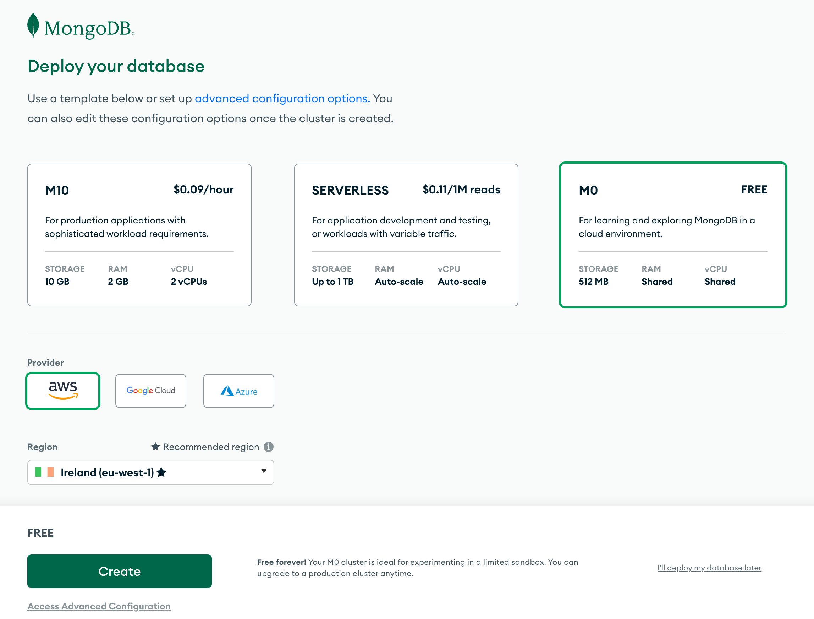

# Prototype of nodeJS API (backend) to a fast develop

**DRY (don't repeat yourself)**

_Aiming to provide a project structure in nodeJS following good practices to achieve a fast development of an API to achieve its deploy._

The live API link can be found, to users [here](https://prototype-fast-dev-nodejs-api-example.onrender.com/api/users) and prototypes [here](https://prototype-fast-dev-nodejs-api-example.onrender.com/api/prototypes)

Examples: [Reading-list-fullstack](https://github.com/patchamama/Reading-list-fullstack)

# Objective

Inspired by the [Agile philosophy](https://en.wikipedia.org/wiki/Agile_software_development) for rapid development and production of software, the following project wants to take a small step with several programmed functionalities to provide an API from a very basic model that can be modified and scaled quickly and that includes authentication with tokens, testing and requests (REST). These functionalities can save hours and money in the process of integrating libraries and their validation.

# Quick summary and staging

If you don't want to read all the documentation (as part of an agile development), with a few steps it is possible to make a couple of modifications and adapt the project to the desired needs. To do this:

1. [Clone the project](#clone-the-repository) and [install dependencies](#install-the-dependencies),
2. [Create the .env configuration file](#create-env-configuration-file),
3. Modify [controllers/prototypeControllers.js](controllers/prototypeControllers.js) and [models/prototype.js](models/prototype.js) to insert new fields or modify the existing ones,
4. [Run the application](#execute-in-dev-).

_See [pending](#pending) and [commits](https://github.com/patchamama/prototype-fast-dev-nodeJS-API/commits/main) section for latest updates if you want to do contributions [(PR)](https://github.com/patchamama/prototype-fast-dev-nodeJS-API/pulls)._

# Table of contents

- [Prototype of nodeJS API (backend) to a fast develop](#prototype-of-nodejs-api--backend--to-a-fast-develop)
- [Objective](#objective)
- [Quick summary and staging](#quick-summary-and-staging)
- [App structure](#app-structure)
- [Features](#features)
  - [Models](#models)
    - [Directory Structure](#directory-structure)
    - [Usage](#usage)
  - [Controllers](#controllers)
    - [Directory Structure](#directory-structure-1)
    - [Usage](#usage-1)
  - [Requests](#requests)
  - [Tests](#tests)
    - [Directory Structure](#directory-structure-2)
    - [Usage](#usage-2)
  - [Utils](#utils)
    - [Directory Structure](#directory-structure-3)
    - [Usage](#usage-3)
- [Bugs](#bugs)
- [Pending](#pending)
- [Technologies Used](#technologies-used)
  - [Languages](#languages)
  - [Libraries and Frameworks](#libraries-and-frameworks)
    - [As a development dependency](#as-a-development-dependency)
  - [Other Tools](#other-tools)
- [Development](#development)
  - [GitHub](#github)
    - [Fork a repository](#fork-a-repository)
    - [Clone the repository](#clone-the-repository)
  - [Local computer](#local-computer)
    - [Execute script to customize the app (optional)](#execute-script-to-customize-the-app--optional-)
    - [Open the IDE of your preference in the terminal](#open-the-ide-of-your-preference-in-the-terminal)
    - [Install the dependencies](#install-the-dependencies)
    - [Create and configure database](#create-and-configure-database)
      - [MongoDB](#mongodb)
        - [Local in the computer](#local-in-the-computer)
        - [MongoDB atlas as remote](#mongodb-atlas-as-remote)
      - [sqlite](#sqlite)
    - [Create .env configuration file](#create-env-configuration-file)
    - [Execute in dev:](#execute-in-dev-)
    - [Open the browser on the port 3003](#open-the-browser-on-the-port-3003)
  - [Adding users](#adding-users)
  - [Customise the prototype model](#customise-the-prototype-model)
  - [Customise the prototype controller](#customise-the-prototype-controller)
  - [Modify routing](#modify-routing)
  - [Customise also file names](#customise-also-file-names)
  - [Perform CRUD operations after modified the prototype](#perform-crud-operations-after-modified-the-prototype)
- [Testing](#testing)
- [Deploy](#deploy)
- [Contribution](#contribution)
- [Credits](#credits)
  - [The idea of the content](#the-idea-of-the-content)
  - [Posible alternatives](#posible-alternatives)

<small><i><a href='http://ecotrust-canada.github.io/markdown-toc/'>Table of contents generated with markdown-toc</a></i></small>

# App structure

<pre>
app.js*
index.js
README.md
controllers
  loginController.js
  prototypeController.js*
  usersController.js
models
  prototype.js*
  users.js
requests
  login.rest
  prototype.rest*
  user.rest
tests
  login.test.js
  prototype.test.js*
  user.test.js
utils
  config.js
  logger.js
  middleware.js  
</pre>

_\* Files to be modified as base to adapt them to new needs._

# Features

## Models

This directory contains the database models used in our Node.js application. Models represent the structure and relationships of data in the database and are used in conjunction with the database management system (e.g., MongoDB or Mongoose) to perform CRUD (Create, Read, Update, Delete) operations on the data.

### Directory Structure

- `user.js`: This file defines the user model, which stores information about users in our application, such as usernames, hashed passwords, and other user-related information.

- `prototype.js`: Here, the prototype model is defined, representing prototype entries in our application. Each prototype entry has properties such as title and can be added other fields as author, URL.

### Usage

These models are used in other parts of the application, such as controllers and routes, to interact with the database. For example, when creating a new user or retrieving a list of blog entries, the corresponding models are used to perform queries and updates in the database.

Ensure that the models are properly configured, and the relationships between them are defined according to the needs of your application.

## Controllers

The "controllers" directory contains the controller functions responsible for handling requests, processing data, and managing the interaction with the database in our Node.js application. Controllers act as intermediaries between the routes and the models, implementing the application's logic and business rules.

### Directory Structure

- `userController.js`: This file contains controller functions related to user management, such as user registration, login, profile updates, and user-specific actions.

- `prototypeController.js`: Here, you'll find controller functions for managing prototype posts, including creating, reading, updating, and deleting prototype entries.

- `loginController.js`: This file houses controller functions responsible for user authentication and login processes. It handles user login requests, verifies user credentials, and issues authentication tokens when users successfully log in.

These controllers collectively manage different aspects of our application, ensuring that user-related actions, blog post operations, and authentication processes are handled efficiently and in accordance with our business logic.

If you'd like to contribute or make enhancements to any of these controllers, please ensure that your changes align with the application's business logic and follow best practices for structuring controller functions.

### Usage

Controllers play a crucial role in processing incoming HTTP requests, validating data, and invoking the appropriate model methods to interact with the database. They are designed to keep the route handlers clean and focused on routing, while business logic and data operations are encapsulated within the controllers.

For example, when a user submits a registration form, the user controller handles the validation of user data, hashes the password, and saves the user information to the database using the user model.

## Requests

The "requests" directory contains files that define different HTTP request configurations. These files contain different types of requests, such as GET, POST, PUT, or DELETE.

## Tests

The "tests" directory contains test suites and test cases used to verify the functionality and correctness of our Node.js application. Testing is a critical part of software development, and this directory is dedicated to organizing and running automated tests to ensure that our code behaves as expected.

### Directory Structure

- `user.test.js`: This file contains unit and integration tests for user-related functionality, such as user registration, login, profile updates, and user-specific actions.

- `prototype.test.js`: Here, you'll find test cases for the prototype-related functionality, covering scenarios like creating, reading, updating, and deleting prototype entries.

- `login.test.js`: This file includes tests for user authentication and login processes. It verifies that user login requests, credentials, and authentication tokens work correctly.

_Additional test files: Depending on the complexity of the application and the number of components, you may find additional test files for other parts of the codebase._

### Usage

Tests are essential for maintaining code quality and ensuring that new changes do not introduce regressions or break existing functionality. We use testing frameworks like Jest to automate the testing process and provide clear pass/fail results.

To run the tests, you can use the following command:

```properties
npm test
```

_This command will execute the test suites defined in the "tests" directory and provide detailed test reports, including any failing test cases._


The tests use the `supertest` library to simulate HTTP requests to the login controller and Jest for assertions, and also are execute in a test database to ensure that the tests run in an isolated enviroment.

## Utils

The "utils" directory contains utility functions and modules used throughout our Node.js application. Utility functions are helper functions or modules that encapsulate common or reusable logic, making code more modular, maintainable, and DRY (Don't Repeat Yourself).

### Directory Structure

- `config.js`: This config file is used to configure various settings for your Node.js application, such as the port to run the server on, the MongoDB URI based on the environment (development or test), and a secret key for authentication. It loads environment variables from a .env file using the dotenv package and provides these values to the rest of your application as needed.

- `logger.js`: This file provides two functions, info and error, for logging information and errors respectively. It checks the NODE_ENV environment variable to determine whether to log messages. Messages are only logged if the environment is not set to 'test,' which is a common practice to prevent logging in test environments where you want to keep the output clean.

- `middleware.js`: This middlewares.js file defines several middleware functions for your Node.js application, including handling unknown endpoints, error handling, token extraction, and user extraction from a JSON Web Token (JWT). These middlewares are used to enhance the functionality and security of your application.

Additional utility files: Depending on the specific needs of your project, you may have additional utility files to assist with tasks such as data manipulation, file handling, or API integrations.

### Usage

Utilities in this directory are designed to simplify common tasks and promote code reusability. They can be imported and used in various parts of the application, including controllers, routes, and middleware.

# Bugs

No errors have been found or reported.

# Pending

- Add use of ~~[mongoDB](https://github.com/patchamama/prototype-fast-dev-nodeJS-API/commit/9a2baeacf56776e96bb8dcfec63fb3559fbcc89e)~~ and sqlite databases locally for development mode.
- ~~Generate script (bash and batch) that automates the renaming of files and content to replace `prototype` with a new desired name in the model and controller, as well as the API URL (router).~~ See commit [here](https://github.com/patchamama/prototype-fast-dev-nodeJS-API/commit/5dd21676361876944e2d15bd7a503df0d26fb309)
- Generate a admin panel with a frontend (react, vanillaJS, jquery) that emulates the same functionalities as the _[Django REST Framework](https://www.django-rest-framework.org/) API Control Panel_ and facilitates the management of models and API behaviour from a web interface.
- Generate a web interface in the frontend that facilitates the creation of models and controllers.
- ~~Use morgan to extends the Express Rest API’s logging capabilities.~~ See commit [here](https://github.com/patchamama/prototype-fast-dev-nodeJS-API/commit/eda4cf97c424863eff724de1823b545d7d8244af)

# Technologies Used

## Languages

- [Javascript](https://en.wikipedia.org/wiki/JavaScript)

## Libraries and Frameworks

- [Node.js](https://nodejs.org/) is a JavaScript runtime built on Chrome's V8 JavaScript engine. It allows you to run JavaScript code on the server side and is commonly used for building scalable network applications.
- [CORS](https://expressjs.com/en/resources/middleware/cors.html) (Cross-Origin Resource Sharing) is a Node.js middleware that enables secure cross-origin communication in web applications. It allows you to define which domains are allowed to access your server resources.
- [Express.js](https://expressjs.com/) is a fast, unopinionated, and minimalist web framework for Node.js. It simplifies the process of building robust and scalable web applications and APIs.
- [Mongoose](https://mongoosejs.com/) is an Object Data Modeling (ODM) library for MongoDB and Node.js. It simplifies the interaction with MongoDB databases by providing a schema-based solution for data modeling.
- [bcrypt](https://github.com/kelektiv/node.bcrypt.js) is a library for hashing passwords securely in Node.js. It uses the bcrypt hashing algorithm to store and verify password hashes, making it a common choice for user authentication.
- [dotenv](https://github.com/motdotla/dotenv) is a zero-dependency module that loads environment variables from a .env file into the process.env object. It's commonly used to manage configuration settings in Node.js applications.
- [express-async-errors](https://www.npmjs.com/package/express-async-errors) is a middleware for Express.js that simplifies error handling in asynchronous routes. It allows you to throw errors in asynchronous code, and it will automatically handle them and send an appropriate response.
- [jsonwebtoken](https://jwt.io/) JSON Web Tokens (JWT) is a compact, URL-safe means of representing claims to be transferred between two parties. In Node.js, the jsonwebtoken library is commonly used to create and verify JWTs for user authentication and authorization.
- [mongoose-unique-validator](https://github.com/blakehaswell/mongoose-unique-validator) is a plugin for Mongoose that provides additional validation for unique fields in MongoDB documents. It ensures that fields marked as unique are not duplicated in the database.
- [morgan](https://github.com/expressjs/morgan) is middleware for Node.js that makes it easy to log HTTP requests in your application. It provides valuable information about incoming requests, such as HTTP methods, routes, status codes, and response times. This is especially useful for tracking and debugging requests in Express applications and other Node.js-based applications.

### As a development dependency

- [cross-env](https://github.com/kentcdodds/cross-env) is a command-line tool that allows you to set environment variables in a cross-platform way. It's often used in npm scripts to ensure consistent behavior across different operating systems.
- [ESLint](https://eslint.org/) is a popular linting tool for JavaScript that helps developers find and fix problems in their code. It enforces coding standards and best practices to ensure code quality.
- [Jest](https://jestjs.io/) is a JavaScript testing framework that makes it easy to write unit and integration tests for your code. It provides a simple and powerful API for testing JavaScript applications.
- [Nodemon](https://nodemon.io/) is a utility that monitors for changes in your Node.js applications and automatically restarts the server when changes are detected. It's commonly used during development to streamline the development process.
- [Supertest](https://github.com/visionmedia/supertest) is a library for testing HTTP assertions in Node.js applications. It allows you to make HTTP requests and assert the responses to ensure that your API endpoints work as expected.

_The version used in every library can be seen [here](package.json) in the package.json file._

## Other Tools

- [GitHub](https://github.com/) - Used to host and deploy the website as well as manage the project.
- [Render](https://render.com/) - Used to deploy the website
- [MongoDB](https://www.mongodb.com/) - Used as database

# Development

This site was made using [Visual Studio Code](https://code.visualstudio.com/) & [GitHub](). The site was further developed using [NodeJS](https://nodejs.org/).

## GitHub

### Fork a repository

A fork is a copy of a repository. Forking a repository allows you to freely experiment with changes without affecting the original project. The steps are as follows:

1. On [GitHub.com](https://github.com/patchamama/prototype-fast-dev-nodeJS-API) navigate to the repository page.
2. In the top-right corner of the page, click [**Fork**](https://github.com/patchamama/prototype-fast-dev-nodeJS-API/fork).


You can fork a repository to create a copy of the repository and make changes without affecting the upstream repository.

### Clone the repository

In GitHub, you have the option to create a local copy (clone) of your repository on your device's hard drive. The steps are as follows:

1. On [GitHub.com](https://github.com/patchamama/prototype-fast-dev-nodeJS-API) navigate to the repository page.
2. Locate the _Code_ tab and click on it.
3. In the expanded window, click the two squares icon to copy the HTTPS link of the repository.


_If you use a online dev IDE integrated in github as gitpod or codeanywhere, you can click on it and open the IDE to do changes_

4. On your computer, open **Terminal**.
5. Navigate to the directory of choice (`cd <path-of-dev>`).
6. Type `git clone https://github.com/patchamama/prototype-fast-dev-nodeJS-API.git .`
7. Press **Enter** and the local clone of the repository will be created in the selected directory.

## Local computer

_(if you prefere a online IDE as gitpod or codeanywhere you can open it and open the terminal included)_

### Execute script to customize the app (optional)

```properties
node tools/update-script.js -r NEW_NAME
```

_This script replaces in the filename and in the content (controller, model, routing) the text `prototype` with the `NEW_NAME`, allowing a quick adaptation of the script to new needs._

For example, if we specify in the `-r Blogs` parameter _(you can put Blogs, blogs, blog, or Blog that at the end will choose the name completely in lower case and singular: `blog` for the replacement)_:

```properties
node tools/update-script.js -r Blogs
```

This would create the folder with contents:

<pre>
Blogs 
  app.js*
  index.js
  README.md
  controllers
    loginController.js
    prototypeController.js > blogController.js
    usersController.js
  models
    prototype.js >  blog.js
    users.js
  requests
    login.rest
    prototype.rest > blog.rest
    user.rest
  tests
    login.test.js
    prototype.test.js > blog.test.js
    user.test.js
  utils
    config.js
    logger.js
    middleware.js  
</pre>

Additionally all references to `prototype` will be replaced by `blog`, for example in the app.js file:

```javascript
const prototypesRouter = require('./controllers/prototypeController')
```

is replaced by

```javascript
const blogsRouter = require('./controllers/blogController')
```

and

```javascript
app.use('/api/prototypes', prototypesRouter)
```

is replaced by

```javascript
app.use('/api/blogs', blogsRouter)
```

Then the `OUTPUT_NEU_NAME` folder will be created, and following the example would be `OUTPUT_Blogs`, and we can proceed to install the dependencies and run the application in this folder:

```properties
cd OUTPUT_Blogs
npm install
npm run dev
```

and then we can open the browser in the new path to access the API:

http://localhost:3003/api/blogs

http://localhost:3003/api/users

### Open the IDE of your preference in the terminal

If you prefere `Visual Studio Code` (vscode):

```properties
code .
```

### Install the dependencies

_In this project `npm` has been used as package manager, but you are free to use another package manager such as `pnpm` because of its popularity and speed._

```properties
npm install
npm start
```

### Create and configure database

#### MongoDB

##### Local in the computer

To install mongoDB y the local computer. With windows the instruction are [here](https://www.mongodb.com/try/download/community) and to mac I will use [Homebrew](https://brew.sh/):

```properties
brew tap mongodb/brew
brew install mongodb-community
```

Finally, type `brew services start mongodb-community` into your terminal. This is what actually starts up the Mongo server. **You’ll need to have the Mongo server running any time you want to interact with your database, view your myFlix app, or use the Mongo shell**.

To stop running the Mongo server, enter the command `brew services stop mongodb-community` in your terminal.

##### MongoDB atlas as remote

Loggin and create account of [MongoDB Atlas](https://www.mongodb.com/atlas/database)


Once you've created and logged into your account of [MongoDB Atlas](https://www.mongodb.com/atlas/database), let us start by selecting the free option and pick the cloud provider and location and create the cluster:



Let's wait for the cluster to be ready for use. This can take some minutes.

NB do not continue before the cluster is ready.

Let's use the _security_ tab for creating user credentials for the database. Please note that these are not the same credentials you use for logging into MongoDB Atlas. These will be used for your application to connect to the database.


Next, we have to define the IP addresses that are allowed access to the database, adding 0.0.0.0 as an IP allows access from anywhere as well.

Finally, we are ready to connect to our database. Start by clicking connect:


and choose: _Drivers_ > _Connect your application_:


The view displays the _MongoDB URI_, which is the address of the database that we will supply to the MongoDB client library we will add to our application.

The address looks like this:

```properties
mongodb+srv://username:<password>@cluster0.kqnrdup.mongodb.net/?retryWrites=true&w=majority
```

We are now ready to use the database.

#### sqlite

_Section is pending_

### Create .env configuration file

```properties
MONGODB_URI='mongodb://localhost/prototype=test'

TEST_MONGODB_URI='mongodb://localhost/test-prototype=test'

SECRET='your-secret-key-for-testing-purposes-only'

PORT=3003
```

_You are free to register at [mongoDB Atlas](https://www.mongodb.com/atlas/database) and paste the login URL provided after creating the username and password is you want to use a remote access or to deploy._

### Execute in dev:

```properties
npm run dev
```

### Open the browser on the port 3003

- Users: [http://locahost:3003/api/users](http://locahost:3003/api/users)
- Prototype: [http://locahost:3003/api/prototypes](http://locahost:3003/api/prototypes)

## Adding users

_You must install in vscode or another similar IDE the plugin: [REST Client](https://marketplace.visualstudio.com/items?itemName=humao.rest-client) to be able to carry out these steps. [Here](https://fullstackopen.com/en/part3/node_js_and_express#the-visual-studio-code-rest-client) some instructions about how to use it_
_Modify `requests\user.rest` to add the users you want. For instance (to add username `root` and `password` test):_

<pre>
POST http://localhost:3003/api/users
Content-Type: application/json

{
  "username": "root",
  "name": "Superuser",
  "password": "test",
  "email": "myemail@email.com"
}
</pre>

_Above POST there should be a `send request` option that would allow you to execute the add action._

Also is possible to use other REST client as [Postman](https://www.postman.com/) or [IntelliJ WebStorm HTTP Client](https://www.jetbrains.com/help/webstorm/http-client-in-product-code-editor.html).

## Customise the prototype model

_Modify the prototype to change the example field `title` and/or add new fields. To do this, the [models/prototype.js](models/prototype.js) file must be modified._

## Customise the prototype controller (manual)

_Manage the behaviour of data insertions (post) and updates (put) in the api. To do this, the [controllers/prototypeController.js](controllers/prototypeController.js) file must be modified._

## Modify routing

_To change the default path [http://localhost:3003/prototypes](http://localhost:3003/prototypes) to a desired path, you would have to change the [apps.js](apps.js) file and change `prototypes` to the new desired path, e.g. if you want to change to `blogs`, it would look like this:_

`app.use('/api/prototypes', prototypesRouter)`

change to:

`app.use('/api/blogs', prototypesRouter)`

## Customise also file names

_If you do not want to use the word `prototypes` in the name of files (model, controllers) and references, you must manually rename the files and change the references to them, such as:_

`const Prototype = require('../models/prototype')`

I would recommend (if you want to change to `blog` for example):

1. Change the file names to a single new desired name, e.g. blog.
2. Open all files and replace the content (it is _casesensitive_):

- `Prototype` to `Blog`
- `prototype` to `blog`

## Perform CRUD operations after modified the prototype

The file [requests/prototype.rest](requests/prototype.rest) can be used as a basis for performing CRUD operations on the modified model based on the controller operations (which must also be modified).

_About the use of .rest files and REST Clients, the follow [section](https://github.com/patchamama/prototype-fast-dev-nodeJS-API#adding-users) can help._

# Testing

In the [tests](tests) folder there are several `tests` that can be run automatically with the following command:

```properties
npm test
```

Note that you will have to modify the tests in `prototype.test.js` to adapt them to the new modifications made.

# Deploy

At the moment as Render can be used without a credit card was selected. Render might be a bit easier to use since it does not require any software to be installed on your machine.

The following assumes that the [sign in](https://dashboard.render.com/) has been made with a GitHub account.

After signing in, let us create a new "web service":


The app repository is then connected to Render:


The connecting seem to require that the app repository is public.

Next we will define the basic configurations. If the app is _not_ at the root of the repository the _Root directory_ needs to be given a proper value:


Select `Create webservice`

Configurate the enviroment with the keys parameters (see the .env file) to define de database conection and secret key.


After this, the app starts up in the Render. The dashboard tells us the app state and the url where the app is running:


According to the [documentation](https://render.com/docs/deploys) every commit to GitHub should redeploy the app. For some reason this is not always working. Fortunately it is also possible to manually redeploy the app.

_The section of [deploying app to internet](https://fullstackopen.com/en/part3/deploying_app_to_internet) of [fullstackopen.com](fullstackopen.com) was used as base to generate this section._

# Contribution

If you wish to contribute or make changes to existing models or controllers, ensure you follow best data modeling practices and conduct thorough testing to ensure changes do not adversely affect other parts of the application. You can apply for contributions to be accepted through the [(Pull requests)](https://github.com/patchamama/prototype-fast-dev-nodeJS-API/pulls).

# Credits

- [MongoDB schema](http://mongoosejs.com/docs/guide.html) and [models](http://mongoosejs.com/docs/models.html)
- [Mongo search query syntax](https://docs.mongodb.com/manual/reference/operator/)
- How to format the objects returned by Mongoose: https://stackoverflow.com/questions/7034848/mongodb-output-id-instead-of-id
- [Mongoose search methods](https://mongoosejs.com/docs/api/model.html)
- [Mongoose validation](https://mongoosejs.com/docs/validation.html)
- [Mongoose unique validator](https://github.com/blakehaswell/mongoose-unique-validator)
- [Mongoose join with the populate method](http://mongoosejs.com/docs/populate.html)
- [Express error handlers](https://expressjs.com/en/guide/error-handling.html)
- [Express router reference](http://expressjs.com/en/api.html#router)
- [Express Admin](https://github.com/simov/express-admin) is a MySQL, MariaDB, PostgreSQL, SQLite admin panel for Node.js.
- [AdminJS](https://github.com/SoftwareBrothers/adminjs) is an automatic admin interface that can be plugged into your application. You, as a developer, provide database models (like posts, comments, stores, products or whatever else your application uses), and AdminJS generates UI which allows you (or other trusted users) to manage content. Inspired by: django admin, rails admin and active admin.
- [Best](https://dev.to/nermineslimane/always-separate-app-and-server-files--1nc7) [practices](https://nodejsbestpractices.com/sections/projectstructre/separateexpress) references.
- Functional Javascript series on [YouTube](https://www.youtube.com/watch?v=BMUiFMZr7vk&list=PL0zVEGEvSaeEd9hlmCXrk5yUyqUag-n84)

### The idea of the content

The idea came to me while I was doing the [exercises](https://github.com/patchamama/fullstackopen-part4-bloglist) of the fourth module: _Testing Express servers, user administration_ of the Full Stack open course: **_Deep Dive Into Modern Web Development_** - https://fullstackopen.com/en/

### Posible alternatives

- [sailsjs.com](https://sailsjs.com/get-started): The MVC framework for Node.js Sails is the most popular MVC framework for Node.js, designed to emulate the familiar MVC pattern of frameworks like Ruby on Rails, but with support for the requirements of modern apps: data-driven APIs with a scalable, service-oriented architecture.
- [CompoundJS](https://github.com/1602/compound) - MVC framework for NodeJS™. It allows you to build web application in minutes.
